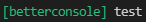

# BetterConsole
A better Javascript console.

## Installation 
Install with [npm](https://www.npmjs.com/):
```sh
$ npm install @bonnietogamer/better-console
```

## Usage
When writing to the console this project will add the project name as a prefix to the console.
By default both the prefix and the paramaters are colored.

```js
require('@bonnietogamer/better-console');

console.log('test');
console.log('test', false);
```
### Output:




### Example 2:

```js
require('@bonnietogamer/better-console');

console.log('log');
console.log('log', false);
console.error('error');
console.error('error', false);
console.info('info');
console.info('info', false);
console.warn('warn');
console.warn('warn', false);
```

### Output:


## About
<details>
<summary><strong>Contributing</strong></summary>

Feel free to make a pull request. If you encounter any issues

</details>
